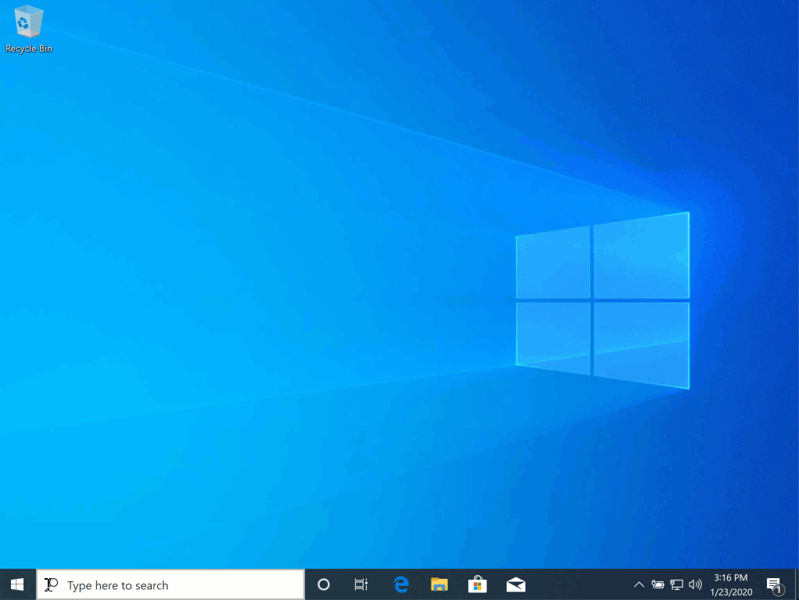
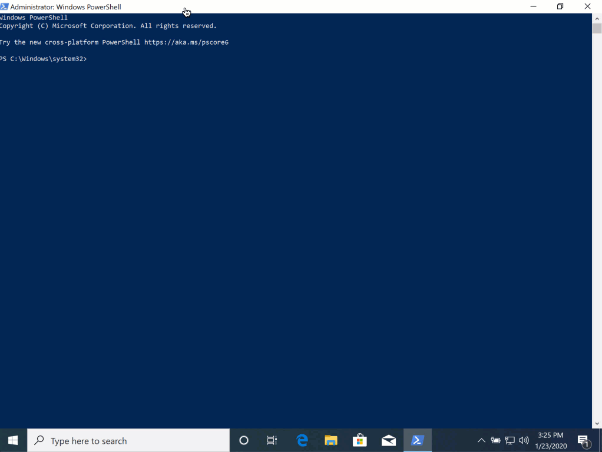
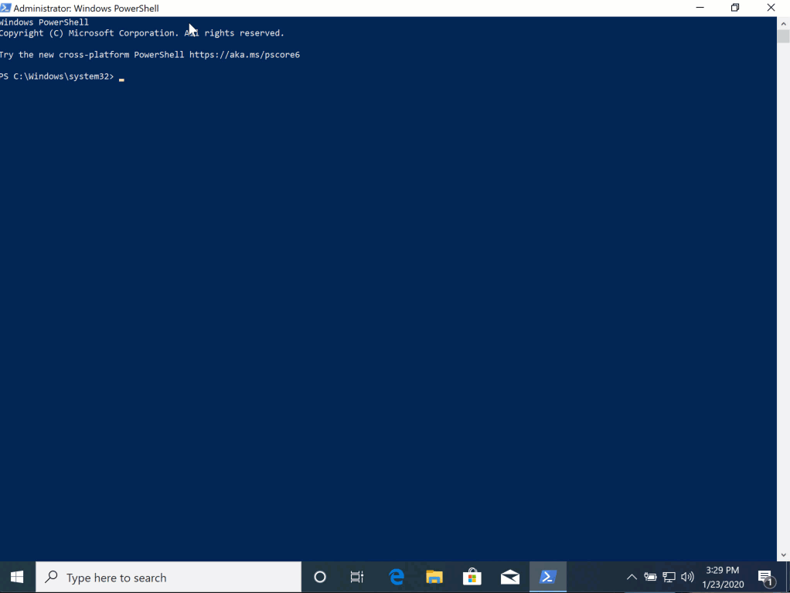
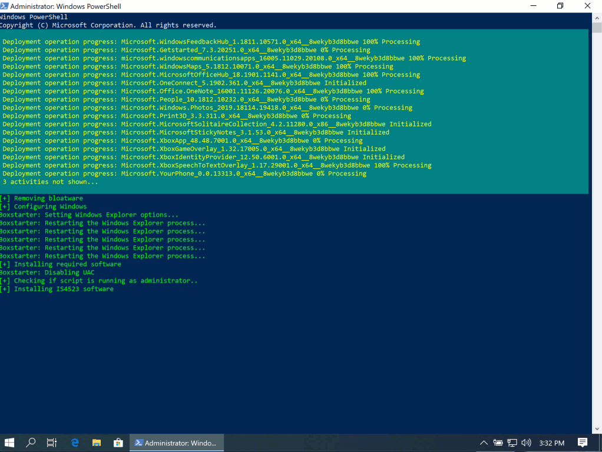

# Deploy Windows 10 Virtual Machine
Ever do a fresh install of Windows 10, only to see a bunch of bloatware like Candy Crush Saga?

This script was designed to configure a newly installed Windows 10 virtual machine for simplicity and privacy. It also installs Boxstarter, a deployment environment for Chocolatey. 

It also has a function to install required software if needed. This means you can host your own powershell script on the Internet (Github repo, gist, etc) and run it along with everything else.

## Legal and Licensing
This software is free to use and comes as is with no warranty. By downloading and running these scripts, you are accepting the risk of any misconfigurations, removal of software, or damages that may occur.

## Usage
Open Powershell (run as an adminstrator) 

Run the following command:

` . { Invoke-WebRequest -useb https://raw.githubusercontent.com/UTSA-cyber/DeployWin10VM/master/DeployCleanWin10.ps1 } | Invoke-Expression; Deploy-NewWindows10`

To run this script with another software installation script, run the following command:

` . { Invoke-WebRequest -useb https://raw.githubusercontent.com/UTSA-cyber/DeployWin10VM/master/DeployCleanWin10.ps1 } | Invoke-Expression; Deploy-NewWindows10 -installPkg URLOFSCRIPT`

## Output
This script will create a transcript for troubleshooting purposes. This should be located in the users Documents directory. 

. { Invoke-WebRequest -useb https://raw.githubusercontent.com/UTSA-cyber/DeployWin10VM/master/DeployCleanWin10.ps1 } | Invoke-Expression; Deploy-NewWindows10 -installPkg "https://gist.githubusercontent.com/jknyght9/d00a10f39f91bd6901d7ceaedbe21176/raw/b02b64a9c7d8065e54ebcc1e0e595afe8b751058/is4523-deployment.ps1"